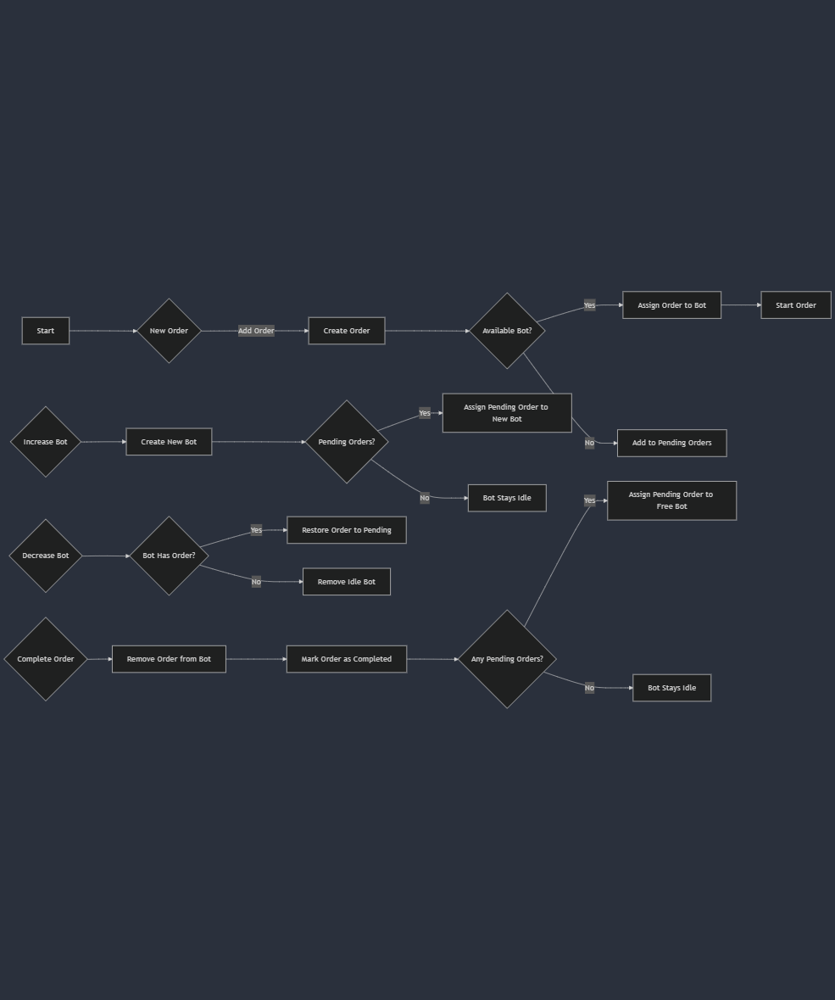

# Feed Me Assessment

This is the assessment app for the feedMe

# Demo
https://feed-me-assessment.netlify.app/

## What is inside?

In this project here is the tools I used:

- Vite
- Tailwindcss
- Prettier
- Zustand (State Management)

## Getting Started

This is how my thought process when designing out the whole flow:



### Install

Access the project directory.

```bash
cd my-app
```

Install dependencies.

```bash
npm install
```

Serve with hot reload at <http://localhost:5173>.

```bash
pnpm run dev
```
